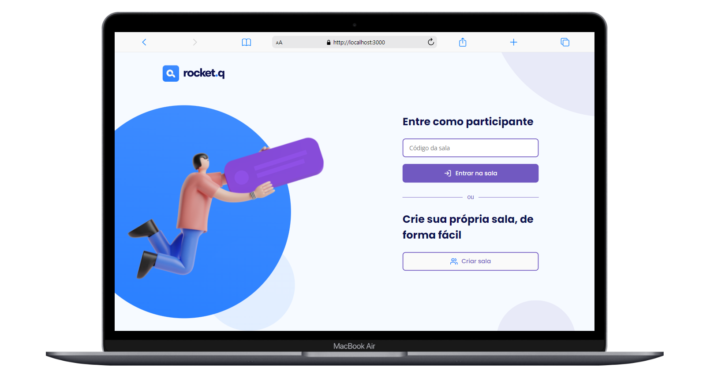

<h1 align="center">
 Rocket.q - Perguntas anônimas
</h1>

 
    

  <a href="#-tecnologias">Tecnologias</a>&nbsp;&nbsp;&nbsp;|&nbsp;&nbsp;&nbsp;
  <a href="#-projeto">Projeto</a>&nbsp;&nbsp;&nbsp;|&nbsp;&nbsp;&nbsp;
  <a href="#-funcionalidades">Funcionalidades</a>&nbsp;&nbsp;&nbsp;&nbsp;

 

## 🚀 Tecnologias
Este projeto foi desenvolvido com as seguintes tecnologias:

- HTML
- CSS
- JavaScript
- NodeJS
- EJS
- Express
- SQLite

## 🚧 Projeto

O Rocket.Q é uma aplicação de interação por meio de perguntas, que oferece a possibilidade de criar salas para que internautas anônimos possam fazer perguntas. Além disso, o criador da sala tem a capacidade de gerenciar essas perguntas, marcando-as como lidas e excluindo, tudo com o auxílio de uma senha exclusiva para controle de acesso.

## Funcionalidades
- Criação de Salas: Os usuários têm a capacidade de criar salas onde outras pessoas podem fazer perguntas anonimamente.

- Interação por Perguntas: Os internautas têm a possibilidade de fazer perguntas de forma anônima dentro das salas criadas.

- Gerenciamento de Perguntas: O criador da sala pode gerenciar as perguntas recebidas, marcando-as como lidas e respondendo conforme necessário.

- Controle de Acesso: O criador da sala tem acesso exclusivo à gestão das perguntas através de uma senha, garantindo privacidade e controle sobre o conteúdo da sala.

  
##  Layout:

Para acessar o layout via figma <a href="https://www.figma.com/file/6PFnyyl5Kwpcd5w1FyzhLi/Roquet.q-(Community)?type=design&node-id=0-1&mode=design&t=NjUEsqk6DqBJvEO5-0">clique aqui</a>

## Inspiração
nlw-06-discover da Rocketseat

---

Feito com ♥ by RossoniPablo
